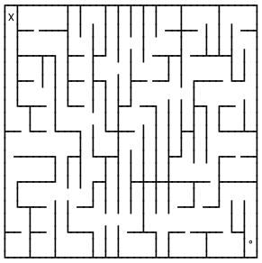

# Maze

## Main goal
- Create random maze of given height and width in command line
- Find the path from `X` to `°`
- Create and saves generated mazes in `.txt` or `.json` file


## How to use
- max dimensions should be around 30x30. If `x * y > 1000`, then max recursion Error can occur
### ONE maze
1. You can change parameters at the end of `main.py`
```python
if __name__ == "__main__":
  Run([20, 10], 0.05) #[width, height] of the generated maze, sleep (interval in seconds between iterations, if =0 then only final result will be printed to command line)
```
2. Run `main.py` in command line and watch as maze creates itself
### MULTIPLE mazes
1. You can change parameters at the end of `dataExport.py`
```python
if __name__ == "__main__":
    sizes = [[3, 3], [3, 3], [7, 5], [10,12]] #this will generate 3 mazes of given dimensions
    createJson = True #this will save data to export.json. default (other then True) is .txt format
```
2. Run `dataExport.py` in command line
3. Use `export.json` or `export.txt` as you want
  - for example, you can use `export.json` with `demo.html`
    - web server is needed as `fetch()` is used (you should rename `export.json` to `demo.json`)


## Structure
`main.py` - run in command line to generate ONE maze. Parameters inside file: `Run([20, 10], 0.05)`.
`dataExport.py` - run in command line to generate MULTIPLE mazes. Parameters inside file: `sizes = [[3,3], [3, 3]]` and `createJson = True`.
`demo.html` - demonstrations purpose (web server is needed as `fetch()` is used).
`demo.json` - demonstrations purpose - data for `demo.html`.